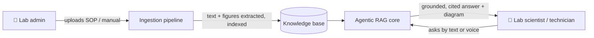
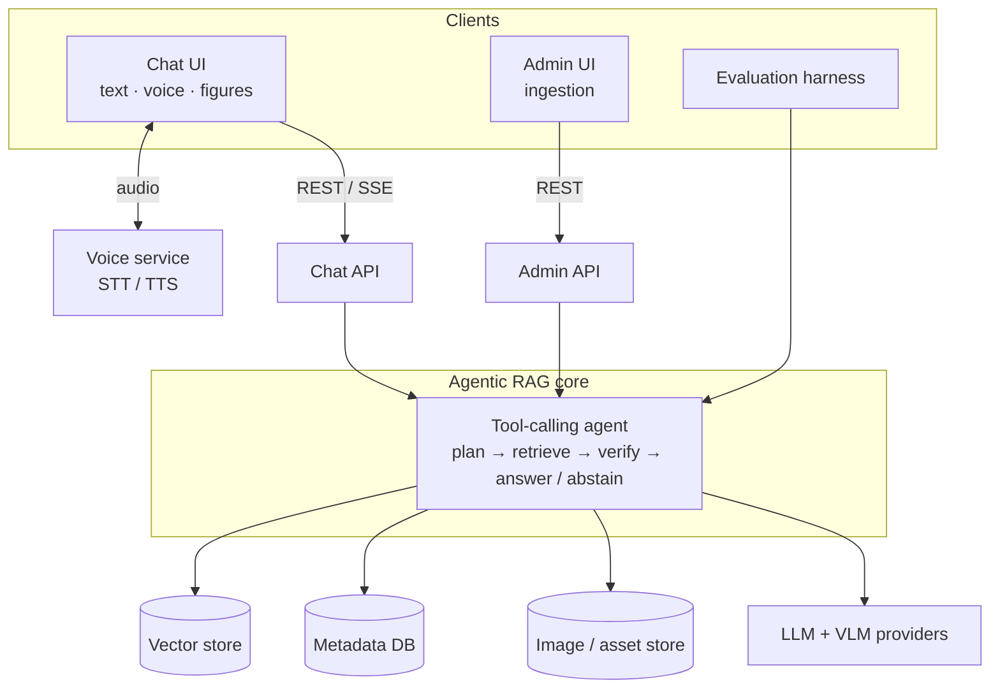

# 🧪 BenchIQ

**A multimodal, voice-enabled RAG assistant that helps medical lab professionals instantly find the right procedure, diagram, or answer across their SOPs and analyzer manuals — replacing slow keyword search and paper binders.**

---

## Contents

1. [🦉 What you're building](#1--what-are-you-building)
2. [🐘 Why build it](#2--why-are-you-building-it)
3. [🦫 System architecture](#3--system-architecture)
4. [🐎 Milestones & timeline](#4--milestones-and-timeline)
5. [🦅 Final deliverables](#5--final-deliverables)

---

## 1. 🦉 What are you building?

**BenchIQ** is a multimodal, voice-enabled RAG application that lets a medical lab professional ask — by text or voice — about their lab procedures and get a grounded, cited answer, including the **relevant diagrams and figures** from the source documents.

Three key features:

1. **Multimodal ingestion** — ingests text *and* figures/diagrams, links each figure to its context, and returns the relevant diagram with the answer.
2. **Voice mode** — ask by speech, hear the answer read back, for hands-busy bench work.
3. **A usable app** — streaming answers, expandable citations, inline figures, and source scoping; fast enough to answer in seconds.

Under the hood it runs as an **agentic workflow**: a tool-calling agent retrieves (and looks up figures) as needed, re-queries when results are thin, checks that its answer is grounded, and abstains when the documents don't cover the question — not a single fixed API call. A moderate **evaluation step** (treated as research) compares configurations so design choices are evidence-driven.

## 2. 🐘 Why are you building it?

Medical labs run many assays across multiple analyzers and test kits, each governed by a dense manual or SOP. Finding one answer today is slow:

- **Paper binders.** Many labs still keep SOPs and manuals on paper — locate the binder, flip to the page.
- **Keyword-only search.** Digital document-control systems match literal keywords, not meaning, so you must remember the manual's exact wording.
- **Too many near-identical files.** Large healthcare systems share document stores with tens of thousands of files and near-duplicate names; finding the right one takes time, and keyword search inside it may still miss.
- **Figures are invisible.** The diagram you need — a pipetting step, how to read a result window — can't be found by text search.

BenchIQ replaces this: **ask once or follow up questions, in plain language or by voice, and get the exact passage and diagram — cited, from across all documents at once.** It answers only from the lab's validated documents and refuses when they don't cover the question. The longer-term vision extends to other healthcare workers navigating large procedural document sets.

## 3. 🦫 Planned System architecture (Not final)

An **agentic RAG core** behind thin API layers. A tool-calling agent orchestrates each turn over pluggable retrieval, storage, and model providers, plus multimodal ingestion and a voice layer.

**Workflow**

**Architecture**

## 4. 🐎 Milestones and timeline

Aligned to the course schedule (Week 8 / 11 / 14). *Exact dates to be confirmed against the syllabus.*

| Milestone | Target | Scope |
|---|---|---|
| **M1 — Ingestion + retrieval** | **Week 8** | Multimodal ingestion (text + figures, figure↔text linking, captioning); hybrid retrieval returning cited answers with inline diagrams; initial corpus ingested; basic Cloud Run build. |
| **M2 — Voice + app + eval harness** | **Week 11** | Voice mode (STT in, TTS out); polished chat UI (streaming, citations, inline figures, source scoping); golden set authored and eval harness running with first results. |
| **M3 — Scaling eval + polish** | **Week 14** | Document-scaling and hybrid-vs-dense experiments; light multimodal eval; UI polish and visible abstention; final report, demo, docs. |

## 5. 🦅 Final deliverables

The final deliverable will be **a working prototype web app plus committed evaluation results**, presented in class.

- **Deployed web app** (Cloud Run) — voice-enabled chat UI + admin ingestion UI running the multimodal agentic workflow.
- **Multimodal ingestion pipeline** — real manuals/kit inserts → indexed knowledge base where figures are retrievable and returned.
- **Voice mode** — ask by speech, hear the answer read back.
- **Evaluation results in `eval/`** — golden set, harness, and a short report (retrieval, faithfulness, citation accuracy, hybrid-vs-dense, document-scaling).
- **Reproducible repo + live demo** — containerized and documented; an end-to-end demo on presentation day (ingest a manual → ask by voice → cited answer with the right diagram).

